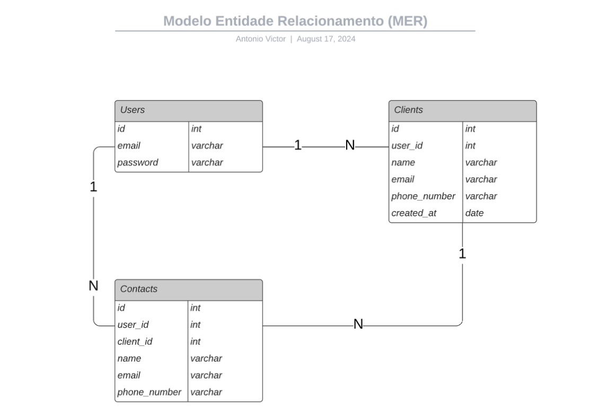

# Fullstack-challenge backend

Api de gerenciamento de clientes e contatos feita durante o desafio fullstack da empresa Casa de Apostas.

## Funcionalidades

- Autenticação (email e senha)
- CRUD de Clientes
- CRUD de Contatos
- Geração de relatório dos contatos do cliente

## Modelagem do Banco (MER)



## Executanto o projeto de forma local

### 1. Instalando Requisitos

Para executar o projeto é necessário alguns programas.

Minha solução foi feita utilizando NodeJS e por isso é necessário ter ele instalado na sua máquina para rodar o projeto.

Além disso, estou utilizando um container do PostgreSQL com o Docker para subir o banco. Para subir o container é preciso ter o Docker e Docker Compose instalado para proesseguir.

- <a href="https://nodejs.org/en/download/package-manager" target="__blank" >NodeJS V21</a>
- <a href="https://docs.docker.com/engine/install/" target="__blank" >Docker e Docker Compose</a>

### 2. Configurando .env

Nesse projeto eu utilizo variáveis de ambiente para proteger algumas informações sensíveis.

Para rodar corretamente a aplicação é necessário criar um arquivo com o nome <b>.env</b> na pasta raíz do projeto e inserir nele exatamente o que eu deixei no arquivo <b>.env.example</b> (esse arquivo está na pasta raíz do projeto também).

Pode copiar esses valores e inserir no .env criado

```
# Server
SERVER_PORT=8080
SERVER_JWT_SECRET=secret

# Database
DATABASE_USER=admin
DATABASE_PASS=admin123
DATABASE_PORT=5432
DATABASE_HOST=localhost
DATABASE_NAME=fullstack_challenge
```

### 3. Subindo o banco

Para subir o banco é muito simples, basta rodar o comando pelo terminal na pasta raíz do projeto.

Linux:

```
docker compose up -d
```

### 4. Subindo a aplicação

Para rodar a aplicação rode no terminal na pasta raíz do projeto esse comando:

Modo de desenvolvimento <b>(Habilita a Documentação do Swagger):</b>

```
npm run start:dev
```

Modo de produção:

```
npm run start
```

## Documentação dos Enpoints da API

### 1. Importar JSON dos endpoints para o Postman

<a href="./docs/api-endpoints-postman.json" download="api-endpoints-postman.json" target="__blank">Baixar JSON</a>

Caso o link não funcione você pode encontrar o json dentro da pasta <b> docs</b> na raíz do projeto.

### 2. Usar Swagger UI

Ao subir a aplicação utilizando o comando

```
npm run start:dev
```

É possível acessar a documentação do Swagger pelo navegador quer fica disponível na rota <b>/api</b>.

É so abrir o navegador no localhost e digitar na url "/api".

<a href="http://localhost:8080/api"> 
Documentação Swagger
</a>
